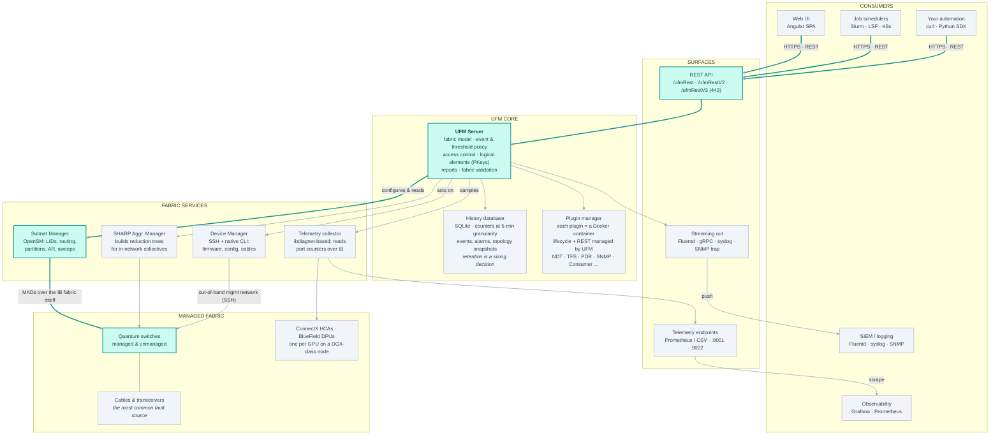
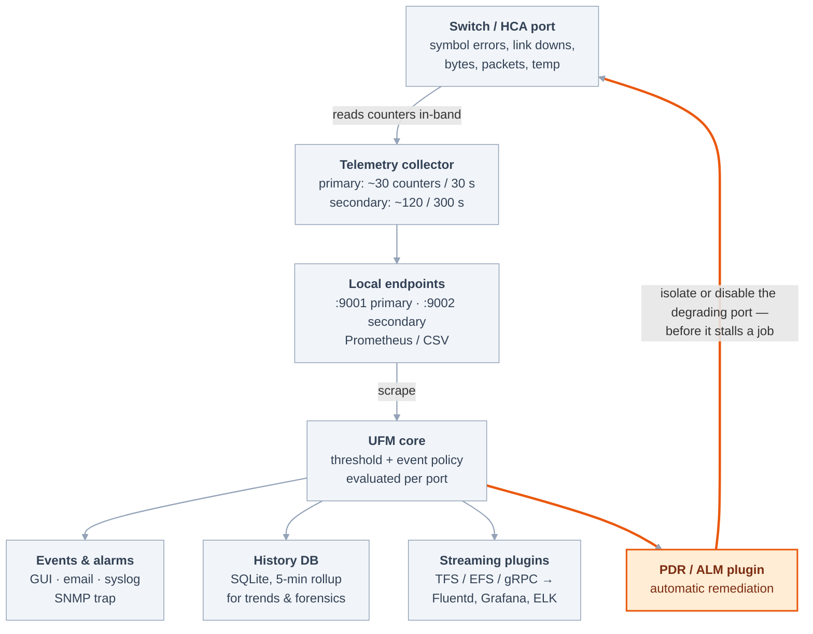

# NVIDIA UFM — architecture and workflow

Background on the real product, for anyone presenting this mock. The
[README](../README.md) covers what the mock implements; this covers what it is
standing in for.

---

## Architecture — who talks to whom

This is the diagram to draw on a whiteboard if the projector dies. Four bands: what
consumes UFM, the surfaces it exposes, the core, and the services that touch the fabric
itself.

**Teal marks the control path** — the chain that can actually change fabric state, from a
REST call down to an OpenSM routing decision. Grey is the observation and out-of-band
path.

Note the split at the bottom: the subnet manager speaks **in-band over InfiniBand itself**,
while device management goes **out-of-band over the regular Ethernet management network**.

---

## What's in the box

If someone asks "so what *is* UFM, as software?", this is the answer. It's a bundle, not a
monolith.

| Component | What it does | Why it matters in the demo |
|---|---|---|
| **UFM Server** | The central Python service holding the fabric model, event and threshold policy, users and roles, reports, and validation logic. | Everything the UI shows is this process's state, served over REST. |
| **OpenSM (SM)** | The open-source subnet manager. Sweeps the subnet, assigns LIDs, computes routing tables, programs switches, enforces partitions. | The mandatory piece. UFM configures and supervises it; it is not UFM's own invention. |
| **Telemetry collector** | `ibdiagnet`-based sampling of per-port counters, exposed on local Prometheus/CSV endpoints. | Source of every number on the dashboard. Two instances — see the flow diagram. |
| **History database** | SQLite store of counters, events, alarms, and topology snapshots. | Enables "show me this port last Tuesday." Also a sizing question customers ask. |
| **Device Manager** | Out-of-band SSH / native CLI to switches: firmware, config, cable and transceiver info. | Explains why UFM wants an Ethernet management network too. |
| **SHARP Aggregation Manager** | Builds and manages the in-network reduction trees on Quantum switches. | The AI-relevant differentiator: collectives run *in* the switch, not just across it. |
| **Web UI** | Angular single-page app. Dashboard, network map, managed elements, events & alarms, telemetry, fabric validation, logical elements, settings. | What you'll actually be clicking. It is a pure REST client — a good point to make. |
| **Plugin framework** | Docker containers whose lifecycle and REST surface UFM manages. | The extensibility story, and where most integrations live. |
| **HA layer** | Active/standby pair with replicated storage over a dedicated dual-link between the two nodes. | Answers "what happens when UFM dies?" before it's asked. |

### The distinction to hold onto

> **UFM is never in the data path.** Not one byte of GPU traffic passes through it. It
> programs the fabric and watches the fabric; the switches forward.

This single sentence answers half the sceptical questions you'll get.

---

## How a counter becomes an action

This is the flow worth walking through slowly, because it's the whole product in one
picture — and because the loop at the bottom is the part that impresses people.

**The orange path is the closed loop:** UFM doesn't just *report* a bad port, it can take
it out of service automatically via the **PDR** (packet-drop-rate) or **Autonomous Link
Maintenance** plugin.

Note the **two collector instances** — a fast, narrow set for alerting and a slow, wide set
for diagnostics — which is why storage sizing is a real conversation (roughly **100 MB per
hour for a 1,000-node fabric** at defaults).
